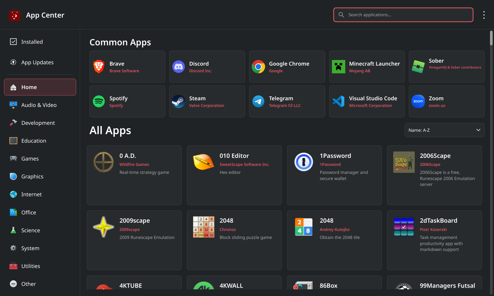
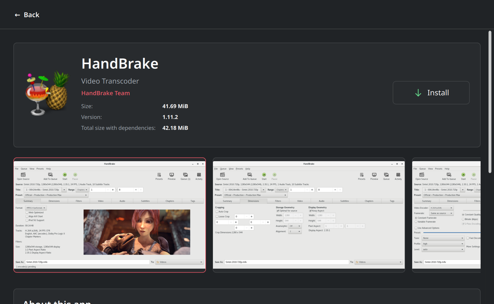

# App Center

App Center is the native application manager for Fluff Linux.

Built with Rust, Qt 6 and QML, it provides a fast, straightforward way to
browse, discover and install Flatpak applications. It integrates with KDE
Plasma and replaces Discover while keeping existing shortcuts working.

Application state, Flatpak operations, queue management and caching are written
in Rust. Small native adapters connect Qt/QML and KDE desktop services. Page
scrolling uses Kirigami while screenshot gestures keep their existing behavior.

The current release is **2026.10 (Beta)**.

## Screenshots

<p align="center">
  
  
</p>

## Features

- Browse Common Apps, categories and searchable application listings.
- Sort applications by name, popularity or release date.
- View app descriptions, publishers, versions, sizes and screenshots.
- Inspect sandbox permissions and manage compatible Flatpak add-ons.
- Install and remove apps from user and system Flatpak installations.
- Review app updates, version changes and changed permissions before updating.
- Follow queued installations and updates with size, speed and progress details.
- Continue active work after closing the window, with native KDE notifications.
- Reopen App Center to return to the running queue.
- Manage Flatpak sources and open local Flatpak files or AppStream links.
- Follow the Plasma light or dark theme and desktop font settings.
- Reuse a 12-hour application-list cache for faster repeat launches.

## App updates and background work

App Center manages **Flatpak app updates**, not system packages. System updates
remain the responsibility of [Fluff Linux Update](https://github.com/FluffNet/flufflinux-update).
App updates are checked only when you press **Check for App Updates**.

Closing the window does not stop queued installations, updates or removals.
KDE shows progress while the window is closed, including the current item in
a batch and a completion summary. Reopening App Center restores the running
session and removes its background progress notification. Active work requests
sleep inhibition and respects KDE's notification and Do Not Disturb settings.

The background service starts on demand. It is not a login autostart or an
automatic update checker, and unfinished work is not resumed after a reboot.

## Discover compatibility

Existing Discover taskbar pins and desktop shortcuts using its standard
launcher or icon names open App Center. The package replaces both `discover`
and `flufflinux-discover` and keeps their desktop and executable aliases.

`plasma-discover`, `discover` and `flufflinux-discover` all point to
`flufflinux-appcenter`. Common Discover navigation commands are supported,
including app searches, app links and opening the updates page.

```sh
flufflinux-appcenter telegram
flufflinux-appcenter --application org.telegram.desktop
flufflinux-appcenter --updates
flufflinux-appcenter --help
```

Local `.flatpak`, `.flatpakref` and `.flatpakrepo` files can also be opened
through App Center. Opening a file or link does not install it automatically.

## Building

Build on Fluff Linux or Arch Linux with KDE Plasma 6. The supported desktop
session is Wayland; macOS and Windows builds are not supported.

### Requirements

Install the build and desktop runtime requirements:

```sh
sudo pacman -S --needed base-devel pkgconf rust ca-certificates qt6-base qt6-declarative \
    qt6-svg qt6-wayland flatpak ostree polkit gzip kirigami \
    qqc2-desktop-style breeze-icons plasma-integration xdg-desktop-portal \
    xdg-desktop-portal-kde xdg-utils desktop-file-utils gtk-update-icon-cache \
    kcoreaddons kiconthemes kwindowsystem kjobwidgets kstatusnotifieritem systemd
```

The Fluff Linux package also requires `flufflinux-update`. App Center uses
system-provided Qt, KDE and libflatpak libraries.

### Build the application

```sh
make
```

The main executable is created at `target/release/flufflinux-appcenter`.
`make` also builds the source-management helper. For an uninstalled development
run, use `cargo run` as your regular desktop user.

## Stage for packaging

```sh
make fakeroot
```

This builds the application and copies the package files into `fakeroot/`,
including `.PKGINFO`, `.INSTALL`, the service and Discover compatibility links.
**Package creation is manual.** No package is created or installed by this
command, and staging does not require sudo. Include the hidden metadata files
when assembling your package.

The package name is `flufflinux-appcenter`, with **FluffNet LLC** as its packager.
Install-time registration and cache updates are handled by `.INSTALL`.

## Install from source

For a direct installation on a development system:

```sh
make
sudo make install
```

This installs the application without creating a pacman package. Use
`sudo make uninstall` to remove a direct source installation. If Discover or
App Center is already package-managed, use a package upgrade or replacement
instead; direct installation will not overwrite it.

## Catalog and configuration

A valid application-list cache is reused immediately for up to 12 hours.
After it expires, App Center refreshes the source metadata and rebuilds the
list, showing **Loading...** with a percentage. First launch requires this
initial catalog load. This refresh does not update installed apps.

Fully offline connections disable browsing and update checks. LAN-only or
limited connections can still try the configured sources; connection failures
are reported when sources cannot be reached. Installed apps remain accessible.

Catalog exclusions live in `/etc/flufflinux-appcenter/exclusions.conf`.
Use one app ID per line; matching is case-insensitive and a trailing `*` matches
an ID prefix. Installed Flatpak apps remain visible even if their ID is excluded.
Staging uses the machine's existing exclusions when available; use
`make fakeroot EXCLUSIONS_FILE=data/exclusions.conf` to package bundled defaults.

## Tests

Run the core and interface checks on the supported Linux environment:

```sh
cargo test
sh tests/run_adapter.sh
sh tests/run_background.sh
sh tests/run_qml_suite.sh
```

Additional native and integration tests are available under `tests/`.
Use a disposable development environment for transaction and packaging tests.

## License

App Center is distributed under the [MIT License](LICENSE).

Copyright © 2026 FluffNet LLC
